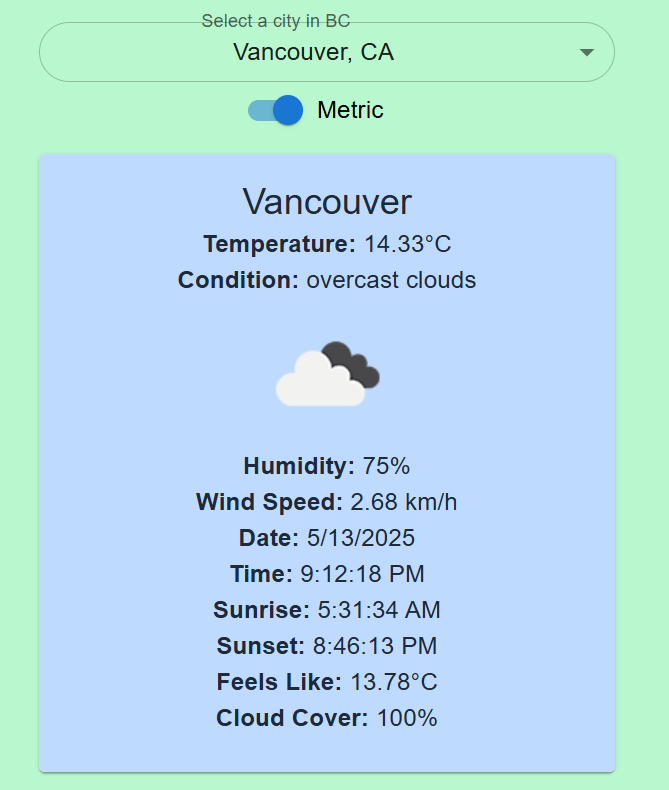

# CS_Weather_BC

A simple React app for viewing weather forecasts in British Columbia cities, with support for metric and imperial units.

## Features

- 🌤️ **City Selection:** Choose a city in BC to view its current weather.
- 🌡️ **Unit Toggle:** Switch between metric and imperial units using a modern toggle switch.
- ⚡ **Live Weather Data:** Fetches up-to-date weather information from a weather API.
- 🖥️ **Responsive UI:** Clean, user-friendly interface built with React and Material-UI.

## Screenshots

<!-- Add screenshots here if you have them -->
<!--  -->

## Getting Started

### Prerequisites

- Node.js (v16 or higher recommended)
- npm 

### Installation

1. **Clone the repository:**
   
   git clone https://github.com/yourusername/CS_Weather_BC.git
   cd CS_Weather_BC
 

2. **Install dependencies:**
  
   npm install
   

3. **Start the development server:**
  
   npm run dev
  

4. **Open your browser and visit:**
   
   http://localhost:5173
  

## Usage

1. Select a city from the dropdown.
2. Toggle between metric and imperial units.
3. View the current weather forecast for the selected city.

## Project Structure

src/
  components/
    CitySelector.jsx
    Weathercast.jsx
    UnitToggle.jsx
    WeatherCard.jsx
  hooks
    useWeatherData.js
  services
    weatherservice.js
  utils
    cities.js
  App.jsx
  App.css
  index.js
  main.jsx

## Technologies Used

- [React](https://react.dev/)
- [Material-UI](https://mui.com/) (for UI components)
- [Vite](https://vitejs.dev/) (for fast development)
- Weather API (specify which one if possible)

## Credits

Created by Robert Navalta for Circuit Stream’s Software Development Bootcamp Class October 2024.

## License

This project is for educational purposes.
